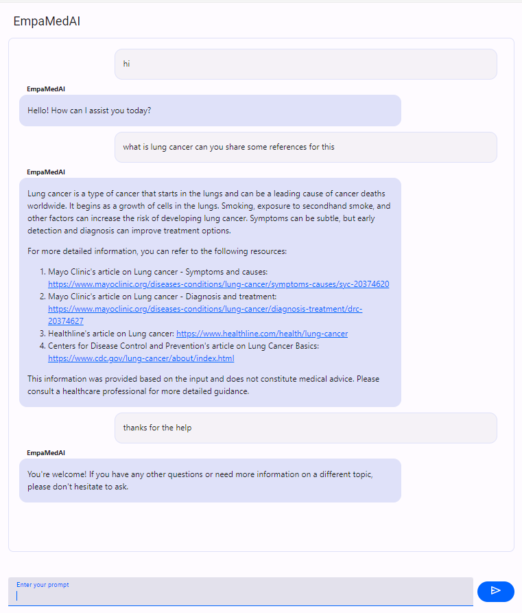

# Empamed AI - README

## Overview

Empamed AI is an intelligent agent designed to assist users with health-related queries by leveraging a suite of tools for identifying medical terms, detecting emotions, and retrieving relevant research papers from PubMed. Built using Langchain's modular framework, Empamed AI interacts with users via chat, providing accurate and empathetic responses.
# Empamed AI

## Sample Chat Interface

Here is a screenshot of the chat interface:



## Features

### 1. **Query2Description Tool**
   - **Purpose**: To identify and explain health-related terms mentioned by users.
   - **Functionality**: 
     - When a user mentions a health condition or term, the tool retrieves relevant information about it.
     - It provides clear explanations, including symptoms, causes, treatments, and preventive measures where applicable.
     - Uses DuckDuckGo to search for relevant information.
     
   - **How It Works**: The tool takes a query as input and searches for reliable descriptions using DuckDuckGo's search engine.

### 2. **Get_PubMed_Papers Tool**
   - **Purpose**: To retrieve research papers related to specific medical topics from PubMed.
   - **Functionality**: 
     - Performs searches on PubMed based on user queries.
     - Retrieves the top 5 relevant articles, including their titles, abstracts, and direct links (DOI, PMC, PubMed IDs).
     - Provides detailed information for user reference.
     
   - **How It Works**: This tool fetches relevant research papers using the Entrez API from PubMed. It constructs links to the papers, allowing users to access them easily.

### 3. **EmotionDetector Tool**
   - **Purpose**: To detect the user's emotions based on their input and respond empathetically.
   - **Functionality**: 
     - Analyzes the user's language for emotional cues, identifying emotions like joy, sadness, anger, fear, or love.
     - Uses a pre-trained Support Vector Machine (SVM) model to predict the emotion.
     - Responds with empathy based on the predicted emotion, ensuring the response aligns with the user's context.
     
   - **How It Works**: This tool uses a machine learning model (SVM) loaded from a saved file, and it predicts the user's emotional state based on text input.

### 4. **Chat Interaction**
   - Empamed AI is powered by the `mistralai/Mixtral-8x22B-Instruct-v0.1` model for generating intelligent and human-like responses.
   - Integrated with the Langchain Agent framework for handling the interaction flow and managing the tools.
   - Responses are streamed in real-time to the user, enhancing the chat experience via Mesop a python framework.

## Usage

### API Key Setup
Empamed AI requires a valid API key for accessing Langchain Together services. To use the tool:

1. Set up your `.env` file and add the following key:
   ```
   TOGETHER_API_KEY=<Your-Together-API-Key>
   ```

2. Load the API key in your environment:
   ```python
   import os
   os.environ["TOGETHER_API_KEY"]=<Your-Together-API-Key>
   ```

### Example Code

```python
from empamed_ai import EmpamedAI

# Example query
history = []
query = "What is hypertension?"
response = EmpamedAI.generate_chat_response(query, history)

for message in response:
    print(message)
```

## Installation

To install and run Empamed AI, ensure you have Python 3.11 installed. The dependencies are managed using [Poetry](https://python-poetry.org/).

1. Clone the repository:
   ```
   git clone https://github.com/your-repo/empamed-ai.git
   cd empamed-ai
   ```

2. Install dependencies using Poetry:
   ```
   poetry install
   ```

3. Create a `.env` file and add your Together API key:
   ```
   TOGETHER_API_KEY=<Your-Together-API-Key>
   ```

4. Run the project:
   ```
   poetry run mesop mesop_ui.py
   ```

## Project Structure

- **tools/**: Contains the tools (Query2Description, Get_PubMed_Papers, EmotionDetector).
- **models/**: Stores the machine learning models (e.g., SVM model for emotion detection).
- **mesop_ui.py**: The entry point for the application to query the agent via chat interface.

## Dependencies

The dependencies for this project are managed with Poetry. Below is an overview of the core dependencies defined in the `pyproject.toml` file:

```toml
[tool.poetry]
name = "empamed-ai"
version = "0.1.0"
authors = ["Sathvika Kopalli"]

[tool.poetry.dependencies]
python = "^3.11"
langchain-groq = "^0.2.0"
duckduckgo-search = "^6.3.0"
langchain = "^0.3.2"
langchain-community = "^0.3.1"
wikipedia = "^1.4.0"
biopython = "^1.84"
langchain-together = "^0.2.0"
python-dotenv = "^1.0.1"
langchain-core = "^0.3.9"
scikit-learn = "^1.5.2"
mesop = "^0.12.5"
```

## Contact

For any inquiries, feel free to reach out to the author: Sathvika Kopalli.
